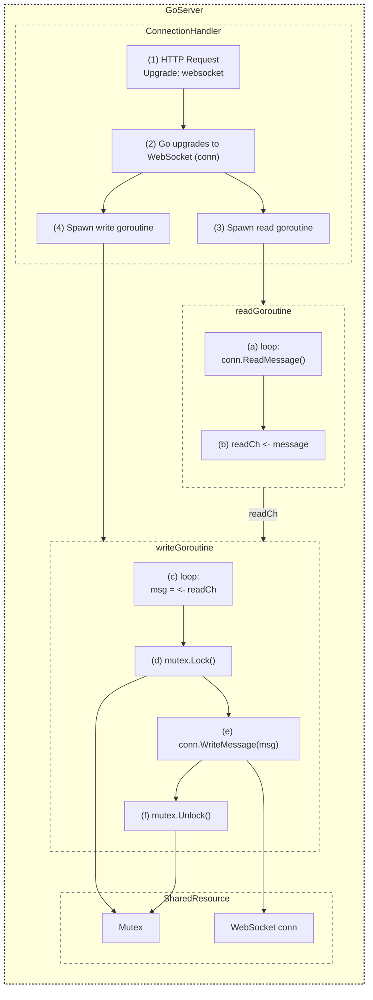

# Websockets and Goroutines (protected by mutex)

## Explanation of the Diagram

1. Connection Handler

   - The client sends an HTTP request with Upgrade: websocket (step 1).
   - The server performs the handshake and obtains a WebSocket conn (step 2).
   - The server spawns two goroutines: one for reading from conn (step 3), and one for writing (step 4).

2. Read Goroutine
   - Continuously calls conn.ReadMessage() (step a).
   - Whenever a new message arrives, it sends that message into a Go channel readCh (step b).

3. Write Goroutine
   - Continuously waits for messages from readCh (step c).
   - Before writing to conn, it locks a mutex (step d).
   - It then writes the message to the conn (step e).
   - Finally, it unlocks the mutex (step f).

4. Shared Resource
   - The WebSocket connection (conn) is a shared resource that multiple goroutines may want to use (e.g., read, write).
   - The mutex ensures that only one goroutine at a time can perform a write operation on conn, preventing concurrency issues and race conditions.

## What Is a Mutex?

A mutex (short for mutual exclusion) is a synchronization primitive that allows only one goroutine (or thread) at a time to access a critical section of code—often a shared resource like a data structure or a network connection. In Go:

- You create a sync.Mutex.
- Call mutex.Lock() before accessing the shared resource.
- Perform your read/write/modify operations.
- Then call mutex.Unlock() to allow other goroutines to proceed.

If a second goroutine calls Lock() on the same mutex while the first goroutine holds the lock, it will block until the first goroutine calls Unlock(). This ensures exclusive access and prevents data races or inconsistent states.

## Why Use a Mutex With WebSockets?

- Writes must be coordinated: The WebSocket specification and libraries typically require that writes to a single conn not happen concurrently from multiple goroutines.
- By funneling all writes through a single goroutine (like in this diagram) or by protecting each write with a mutex, you ensure thread-safe (goroutine-safe) operations on the WebSocket connection.
